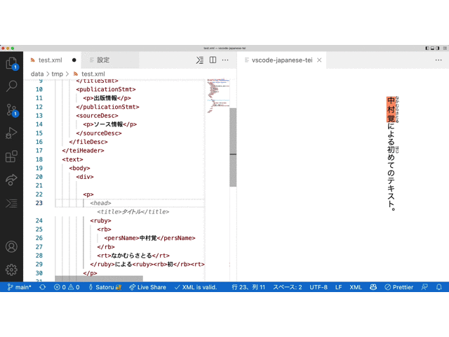
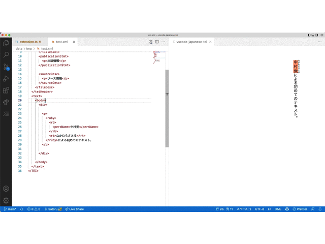
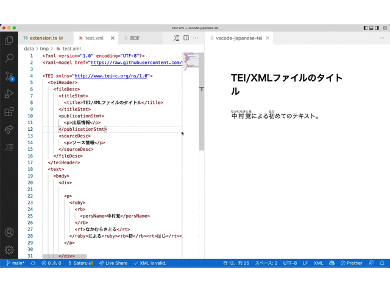

# TEI Japanese Editor

Edit and display TEI/XML

TEI/XMLファイルの編集/表示用のVSCode拡張機能

参考：https://zenn.dev/nakamura196/books/d5b50bb610a9e2

## Features

`@en`

- Real-time preview
- Use custom style
- Input aids for some tags such as `<ruby>` and `<app>`

`@ja`

- リアルタイムプレビュー機能
- カスタムスタイルの使用
- `<ruby>` や `<app>` などの一部のタグの入力補助

### Commands

Command | Shortcut | Mac | Other
---------|----------|---------|---------
Generate panel / プレビューを開く | ctrl-k v |  cmd-k v | 
Insert ruby / ルビを挿入する | ctrl-k r |  cmd-k r | 
Insert warichu / 割注を挿入する | ctrl-k w |  cmd-k w | 

## Configuration

### fontSize

`@en`

Base font size to use for the preview panel

`@ja`

プレビューパネルで使用する基本フォントサイズ

### odd

`@en`

Select ODD file

`@ja`

適用するODDファイルを選択する

### useStylesCETEIcean

`@en`

Use CETEIcean styles

`@ja`

CETEIceanのスタイルを使用する

### useCustomStyle

`@en`

Use Custom styles

`@ja`

独自のcssを使用する

### customStyle

`@en`

Input custom css

`@ja`

独自のcssを入力する

## Release Notes

### 0.0.1

Initial release

### 0.0.2

Add some configurations

### 0.0.3

Minor update

### 0.0.4

Update readme

### 0.0.5

Add odd file support

### 0.0.6

Bug fix